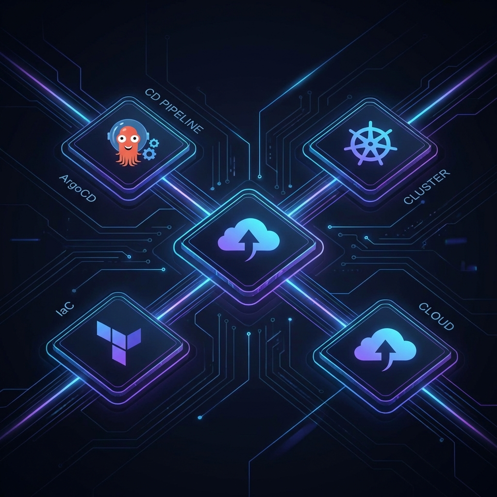

# 🐙 ArgoCD Platform Deployment

[](https://opensource.org/licenses/MIT)
[](https://kubernetes.io/)
[](https://argoproj.github.io/cd/)

> Enterprise-grade GitOps platform orchestration for multi-tenant Kubernetes clusters.

## 🏗️ Architecture



This repository serves as the **Single Source of Truth** for the entire cluster state. It leverages the **App-of-Apps** pattern to manage lifecycle of core infrastructure and application workloads.

## 🚀 Quick Start

Ensure `kubectl` is configured for your cluster, then run:

```bash
make deploy
make projects
make apps
```

## 📁 Repository Structure

- `applications/`: High-level ArgoCD Applications defining workloads.
- `projects/`: `AppProject` definitions for RBAC and environment isolation.
- `infrastructure/`: Base Helm charts and Kustomize overlays for cluster-critical tools.

## 🛡️ Governance & Security

- All changes must go through PR review.
- Namespace isolation enforced via `AppProject` destinations.
- Automated sync-policy with self-healing enabled.

---
Created and maintained by **Ramchandra Chintala**
